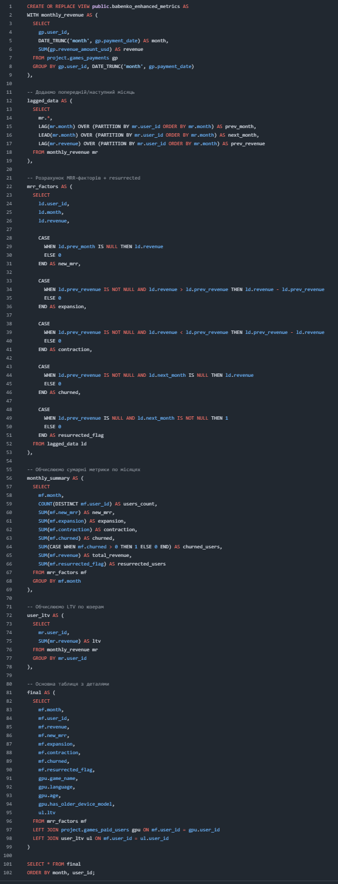
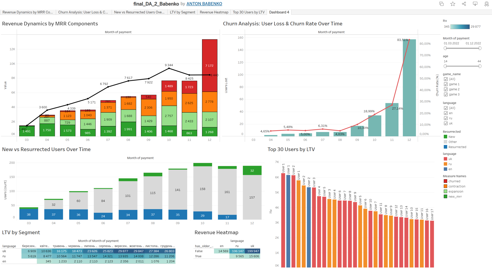

# Revenue & Churn Analysis Dashboard

This project showcases a visual analysis of customer behavior over time using SQL queries and Tableau Public. The goal was to identify revenue trends, user churn, LTV, and user segmentation to support strategic product decisions.

## 🎯 Project Goals

- Calculate detailed MRR components (new, expansion, contraction, churn)
- Identify churned and resurrected users
- Analyze user lifetime value (LTV)
- Segment users by language, game, device type, and age
- Present all metrics via Tableau dashboard

## 📊 Key Metrics Displayed

- **MRR Breakdown** – New, Expansion, Contraction, Churn
- **Churn Rate** over time
- **Resurrected Users**
- **Top 30 Users by LTV**
- **LTV by Segment** (language, age, game_name, device type)
- **Revenue Heatmap**

## 🧩 SQL Logic

SQL queries were executed via **DBeaver** in **PostgreSQL**, and include:
- `LAG`, `LEAD` window functions
- Classification of users into churned, new, resurrected
- Monthly revenue aggregation
- User-level LTV computation

### SQL View Used

A PostgreSQL view `babenko_enhanced_metrics` was created using this logic:  
📄 [sql_join.sql](sql_queries/sql_join.sql)

### SQL Preview

## 📊 Dashboard Preview

## ▶️ Video Demonstration

Watch the walkthrough video:  
👉 [https://youtu.be/gkC3pP_tc1w](https://youtu.be/iWqqd7ZRQrI?si=ymnR-uqnI3U2n1rK)

## 🔗 Tableau Public Dashboard

👉 [View on Tableau Public](https://public.tableau.com/views/final_DA_17525341835200/Dashboard1?:language=en-US&:sid=&:redirect=auth&:display_count=n&:origin=viz_share_link)

## 🛠 Technologies Used

- **PostgreSQL** — data processing  
- **DBeaver** — SQL query development  
- **Tableau Public** — dashboard visualization  
- **GitHub** — documentation & version control

## 📦 Folder Structure

## 📣 Author

Anton Babenko — Data Science & Analytics student @ GoIT
